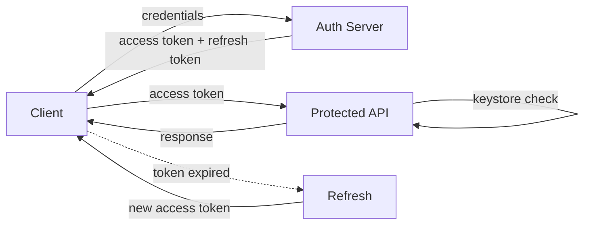
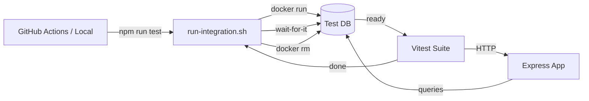

# Finance Tracker API

A backend API for managing personal finance records with **role-based access**, a rich **analytics dashboard**, and **secure multi-session JWT auth**.

---

## ↗ Live API

| | |
|---|---|
| **Swagger Docs** | [zorvyn-assignment-6miv.onrender.com/api-docs](https://zorvyn-assignment-6miv.onrender.com/api-docs) |
| **Base URL** | `https://zorvyn-assignment-6miv.onrender.com` |

> The Swagger UI lists every endpoint, expected request bodies, responses, and lets you test directly from the browser.

---

## Table of Contents

- [Features](#features)
- [Tech Stack](#tech-stack)
- [Docker — Running the App](#docker--running-the-app)
- [JWT & Auth Workflow](#jwt--auth-workflow)
- [Refresh Token — Auto Renewal](#refresh-token--auto-renewal)
- [Role-Based Access Control](#role-based-access-control)
- [API Endpoints & Permissions](#api-endpoints--permissions)
- [Analytics Dashboard](#analytics-dashboard)
- [Testing](#testing)
- [Test Users](#test-users)

---

## ⚡ Features

- **Authentication** — Signup, signin, signout, and token refresh
- **Multi-session JWT** — Each session gets its own keystore entry; revoke one without affecting others
- **Finance Records CRUD** — Create, read, update, and soft-delete records
- **Analytics Dashboard** — Rich financial insights (see [Analytics](#analytics-dashboard))
- **Paise ↔ Rupee** — All amounts stored in paise; converted automatically in responses
- **Role-Based Access** — Three-tier permission model (VIEWER, ANALYST, ADMIN)
- **Rate Limiting** — Global: 100 req/15 min · Auth routes: 10 req/15 min
- **Filtering & Pagination** — Filter by date range, category, and type; paginated with bounds validation
- **CI/CD** — Automated tests on every push via GitHub Actions
- **Dockerized** — Multi-stage build for lean production images; isolated test database via Docker

---

## ⚙ Tech Stack

| Layer | Technology |
|---|---|
| **Runtime** | Node.js 22 |
| **Framework** | Express.js 5 |
| **Language** | TypeScript |
| **Database** | PostgreSQL |
| **ORM** | Prisma |
| **Authentication** | JWT (Access + Refresh Token) |
| **Validation** | Zod + zod-to-openapi |
| **Logging** | Winston + Daily Rotate File |
| **Security** | Helmet, bcryptjs |
| **Testing** | Vitest + Supertest |
| **Containerization** | Docker (multi-stage build) |
| **API Docs** | Swagger UI / OpenAPI |
| **CI/CD** | GitHub Actions |
| **Rate Limiting** | express-rate-limit |

---

## 🐳 Docker — Running the App

> **Docker is the only supported way to run this project.** No manual Node.js or database setup required.

The Dockerfile uses a **two-stage build**:

- **Builder** — Installs dependencies, generates Prisma client, compiles TypeScript
- **Production** — Copies only compiled output and production packages; runs as a non-root user with `dumb-init`

```bash
cp .env.example .env
docker compose up --build
```

The API will be available at `http://localhost:9090` and Swagger docs at `/api-docs`.

> ⚠ Do not run `npm run dev` or `npm start` directly — Docker manages the environment, database connection, and migrations.

---

## ◈ JWT & Auth Workflow



- **Access Token** — Short-lived; sent on every request and validated against the keystore.
- **Refresh Token** — Long-lived; only used to issue a new access token when the current one expires.
- **Keystore** — Each login creates a unique row. Revoking a session invalidates only that row — other sessions stay active.

---

## ↺ Refresh Token — Auto Renewal

When your access token expires, the client does **not** need to log in again.

```
POST /auth/token/refresh
Authorization: Bearer <refresh_token>
```

1. Server validates the refresh token against the keystore.
2. A **new access token** is issued — no credentials needed.
3. Keystore keys are **rotated** to block replay attacks.
4. The client swaps in the new token and retries the request seamlessly.

**Why this design:**
- Short-lived access tokens limit exposure if intercepted.
- Refresh tokens are long-lived but never sent on regular requests, so they're rarely at risk.
- Revocation is instant — flip `status = false` on the keystore row and both tokens stop working immediately.

> ⚠ If the refresh token is also expired or revoked, the user must log in again.

---

## ◆ Role-Based Access Control

Access is enforced organization-wide via middleware — not scoped per user or record.

| Role | Description |
|---|---|
| `ADMIN` | Full access — manage users, create/edit/delete records |
| `ANALYST` | Read-only access to records and dashboard |
| `VIEWER` | Same as ANALYST — records and dashboard viewing only |

---

## ◎ API Endpoints & Permissions

| Endpoint | Method | ADMIN | ANALYST | VIEWER |
|---|---|:---:|:---:|:---:|
| `/auth/signup` | POST | ✓ | ✓ | ✓ |
| `/auth/signin` | POST | ✓ | ✓ | ✓ |
| `/auth/signout` | POST | ✓ | ✓ | ✓ |
| `/auth/token/refresh` | POST | ✓ | ✓ | ✓ |
| `/records` | POST | ✓ | ✗ | ✗ |
| `/records` | GET | ✓ | ✓ | ✓ |
| `/records/:id` | PUT | ✓ | ✗ | ✗ |
| `/records/:id` | DELETE | ✓ | ✗ | ✗ |
| `/records/filter` | GET | ✓ | ✓ | ✗ |
| `/dashboard/total-income` | GET | ✓ | ✓ | ✓ |
| `/dashboard/total-expense` | GET | ✓ | ✓ | ✓ |
| `/dashboard/balance` | GET | ✓ | ✓ | ✓ |
| `/dashboard/recent` | GET | ✓ | ✓ | ✓ |
| `/dashboard/category` | GET | ✓ | ✓ | ✗ |
| `/dashboard/monthly-trends` | GET | ✓ | ✓ | ✗ |
| `/dashboard/weekly-trends` | GET | ✓ | ✓ | ✗ |
| `/dashboard/highest-expense` | GET | ✓ | ✓ | ✗ |
| `/dashboard/avg-spending` | GET | ✓ | ✓ | ✗ |
| `/admin/:id/role` | PATCH | ✓ | ✗ | ✗ |
| `/admin/:id/status` | PATCH | ✓ | ✗ | ✗ |

> Only `ADMIN` can create new users via `/auth/signup`. Regular users cannot self-register.

---

## △ Testing

Tests are written with **Vitest** and **Supertest**, and run automatically in **GitHub Actions** on every push and pull request.

### Isolated Docker PostgreSQL for Integration Tests

Integration tests spin up a **dedicated Docker PostgreSQL container** fresh for every run, then tear it down immediately after.

- Your real database is never touched
- Tests always start from a clean, known state
- The same flow runs identically locally and in CI



```bash
# Docker must be running — the script handles the rest
npm run test
```

> `run-integration.sh` spins up Postgres, waits for readiness, runs Prisma migrations, executes the full Vitest suite, then tears the container down — pass or fail.

---

## ◇ Test Users

Pre-seeded accounts for local development and Swagger testing.

| Email | Password | Role |
|---|---|---|
| `admin@gmail.com` | `123456` | ADMIN |
| `test@gmail.com` | `123456` | ANALYST |
| `analyst@gmail.com` | `123456` | VIEWER |

---

## ⌬ Project Structure

```
src/
├── routes/         # API endpoint definitions
├── core/           # JWT utils, auth helpers, error handling
├── database/       # Prisma repositories (user, keystore, records)
├── middlewares/    # Validation, authentication, rate limiting
└── tests/          # Vitest integration & unit tests
```
